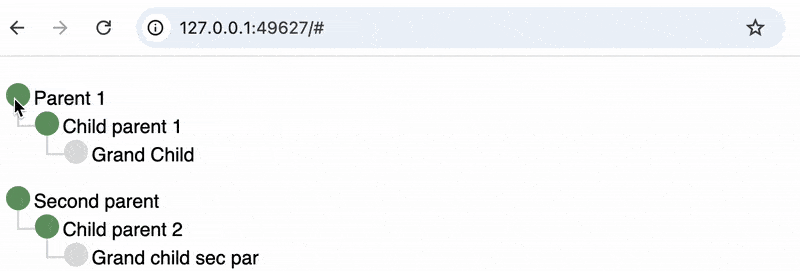
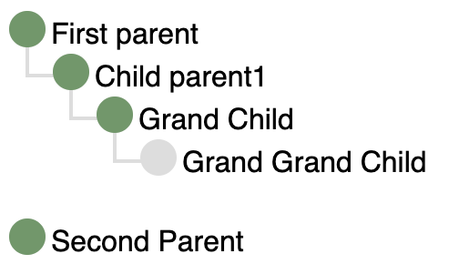
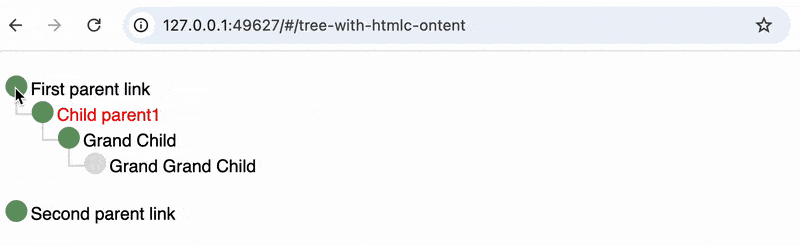

# Stilljs TreeView Component

The StillTreeView is a Still vendor component based on <a href="https://iamkate.com/code/tree-views/">imkate's</a> implementation which is a pure and 100% vanilla CSS. The Still.js implementation allows the building of tree in a dynamic way as well as by specifying a JSON with the structure and intended hierarchy.

# Table of Contents
1. [Instalation](#instalation)
2. [Setup the prefetch in the Still.js Application level](#setup-the-prefetch-in-the-stilljs-application-level)
3. [Adding Data from JSON to the Tree](#adding-data-from-json-to-the-tree)
4. [Adding Data or Nodes Dynamically to the Tree](#adding-data-or-nodes-dynamically-to-the-tree)
5. [Clone the git repository and run the sample](#clone-the-git-repository-and-run-the-sample)

<br/>

#### Instalation

This dependency installation is to be done inside a Still.js project, hence we need to use the <a href="https://www.npmjs.com/package/@stilljs/cli?ref=pkgstats.com" target="_blank">still CLI tool</a>.

```
stilljs install @stilljs/treeview
```

<br>


#### Setup the prefetch in the Stilljs Application level
Once installed the component will be placed inside `@still/vendors/` folder. The `StillAppSetup` class is the `config/app-setup.js` file. 

StrillTreeView setup is being done from line 12 to 16, on line 19 we are running the prefetc as it's needed.

```{.javascript .numberLines .lineAnchors}
import { StillAppMixin } from "../@still/component/super/AppMixin.js";
import { Components } from "../@still/setup/components.js";
import { HomeComponent } from "../app/home/HomeComponent.js";
import { AppTemplate } from "./app-template.js";

export class StillAppSetup extends StillAppMixin(Components) {

    constructor() {
        super();
        this.setHomeComponent(HomeComponent);

        // Setting the component to be prefetched
        this.addPrefetch({
            component: '@still-treeview/StillTreeView',
            assets: ["tree-view.css"]
        });

        // Run prefetch setting
        this.runPrefetch();
    }
    async init() {
        return await AppTemplate.newApp();
    }

}

```

<br>

#### Adding Data from JSON to the Tree

Embeding the TreeView into another component template

The JSON Data.

```js
import { ViewComponent } from "../../@still/component/super/ViewComponent.js";
import { StillTreeView } from "../../@still/vendors/still-treeview/StillTreeView.js";

export class HomeComponent extends ViewComponent {

    isPublic = true;

    /** 
     * @Proxy 
     * @type { StillTreeView } */
    tviewProxy;

    //Embeding the Treeview component into another component
    template = `
        <div>
            <st-element 
                proxy="tviewProxy"
                component="@still-treeview/StillTreeView">
            </st-element>
        </div>
    `;

    //This Hook will make the Tree to be handled only when HomeComponent is fully rendered
    stAfterInit(){
        //Degining the structure of the tree
        const dummyTreeData = {
            "1": {
                "content": "Parent 1",
                "childs": [
                    {
                        "content": "Child parent 1",
                        "childs": [ { "content": "Grand Child", "childs": [] } ]
                    }
                ],
                "isTopLevel": true
            },
            "2": {
                "content": "Second parent",
                "childs": [
                    {
                        "content": "Child parent 2",
                        "childs": [ { "content": "Grand child sec par", "childs": [] } ]
                    }
                ],
                "isTopLevel": true
            }
        }

        // This will make sure that data is added in the Tree only when it's fully loaded
        this.tviewProxy.on('load', () => {
            //Adding the data to the to the Tree
            this.tviewProxy.addData(dummyTreeData);
            //Instruct the Tree to render
            this.tviewProxy.renderTree();
        })
    }
}
```
##### Result:


<br>
<br>
<br>

#### Adding Data or Nodes Dynamically to the Tree
We can also add the nodes dynamically making it more flexible to work with data from the application flow (e.g. Database, API).
```js
import { ViewComponent } from "../../../@still/component/super/ViewComponent.js";
import { StillTreeView } from "../../../@still/vendors/still-treeview/StillTreeView.js";

export class DynamicLoadedTree extends ViewComponent {

	isPublic = true;

    /** 
     * @Proxy 
     * @type { StillTreeView } 
     * */
    tviewProxy;

    template = `
        <div>
            <st-element 
        	proxy="tviewProxy"
        	component="@still-treeview/StillTreeView">
            </st-element>
        </div>
    `;

    stAfterInit(){

        this.tviewProxy.on('load', () => {
            this.dynamicTreeNodes();
            this.tviewProxy.renderTree();
        });

    }

    dynamicTreeNodes(){

        const p1 = this.tviewProxy.addNode({ content: 'First parent',isTopLevel: true });
        const p2 = this.tviewProxy.addNode({content: 'Second Parent', isTopLevel: true });

        const child1 = this.tviewProxy.addNode({ content: 'Child parent1' });
        p1.addChild(child1);

        const grandChild = this.tviewProxy.addNode({ content: 'Grand Child' })
        child1.addChild(grandChild);

        grandChild.addChild({ content: 'Grand Grand Child' })
        
    }
}
```

##### Result:


<br>
<br>
<br>


<br>

#### Adding Data/Nodes with HTML and event binding
```js
import { ViewComponent } from "../../../@still/component/super/ViewComponent.js";
import { StillTreeView } from "../../../@still/vendors/still-treeview/StillTreeView.js";

export class TreeWithHTMLContent extends ViewComponent {

    isPublic = true;

    /** 
     * @Proxy 
     * @type { StillTreeView } */
    tviewProxy;

    template = `
	<div>
	    <st-element 
                proxy="tviewProxy"
                component="@still-treeview/StillTreeView">
            </st-element>
	</div>
    `;

    stAfterInit(){

        this.tviewProxy.on('load', () => {
            this.dynamicTreeNodes();
            this.tviewProxy.renderTree();
        })

    }

    dynamicTreeNodes(){
        //Top level node are calling a method in the parent component (HomeComponent)
        const p1 = this.tviewProxy.addNode({
            content: `<a onclick="parent.printOnAlert($event, '1st parent')">First parent link</a>`,
            isTopLevel: true 
        });

        const p2 = this.tviewProxy.addNode({
            content: `<a onclick="parent.printOnAlert($event, '2nd parent')">Second parent link</a>`,
            isTopLevel: true,
        });

        const child1 = this.tviewProxy.addNode({ content: `<span style="color: red;">Child parent1</span>` });
        p1.addChild(child1);

        const grandChild = this.tviewProxy.addNode({ content: 'Grand Child' })
        child1.addChild(grandChild);

        grandChild.addChild({ content: 'Grand Grand Child' });
    }

    //Method tha is bound to the tree nodes
    printOnAlert(event, text){
        event.preventDefault();
        alert(text);
    }
}

```
##### Result:


#### Embeding as a remote component
Still.js supports remote embedding of self-contained components (no third-party imports) without local installation—only a minor change is needed.:
```html
<div>
  <st-element 
    proxy="tviewProxy"
    component="npm/@stilljs/treeview/StillTreeView">
  </st-element>
</div>
```
To include tree-view.css when remotely embedding `StillTreeView`, manually import it in the embedding component’s JS file:

```js
import sheet from 'https://cdn.jsdelivr.net/npm/@stilljs/treeview@latest/tree-view.css' with { type: 'css' };
document.adoptedStyleSheets = [sheet];
```

In the above scenario, because we're embeding from NPM, we have the npm/ prefix, and the the namespace of the packege and finally the Component name.

<br>
<br>
<br>


### Clone the git repository and run the sample
Got to the <a href="https://github.com/still-js/treeview" target="_blank">Still.js TreeView</a> GitHub repository, clone or download it, follow the bellow instrcutions to run it.

```py
cd examples/vendors-poc
st serve

# The different examples are under the follow URLs:
# /HomeComponent
# /dynamic-loaded-tree
# /tree-with-htmlc-ontent 
```

PS: This is a sample Still.js project which implements the TreeView component, as it does not work in another context.

<br>
<br>

#### Join Still.js discord channel

<a href="https://discord.gg/fUVJRTmQ9f">
<svg xmlns="http://www.w3.org/2000/svg" width="25" style="float: left; padding-right: 5px;" viewBox="0 0 640 512"><!--!Font Awesome Free 6.7.2 by @fontawesome - https://fontawesome.com License - https://fontawesome.com/license/free Copyright 2025 Fonticons, Inc.--><path d="M524.5 69.8a1.5 1.5 0 0 0 -.8-.7A485.1 485.1 0 0 0 404.1 32a1.8 1.8 0 0 0 -1.9 .9 337.5 337.5 0 0 0 -14.9 30.6 447.8 447.8 0 0 0 -134.4 0 309.5 309.5 0 0 0 -15.1-30.6 1.9 1.9 0 0 0 -1.9-.9A483.7 483.7 0 0 0 116.1 69.1a1.7 1.7 0 0 0 -.8 .7C39.1 183.7 18.2 294.7 28.4 404.4a2 2 0 0 0 .8 1.4A487.7 487.7 0 0 0 176 479.9a1.9 1.9 0 0 0 2.1-.7A348.2 348.2 0 0 0 208.1 430.4a1.9 1.9 0 0 0 -1-2.6 321.2 321.2 0 0 1 -45.9-21.9 1.9 1.9 0 0 1 -.2-3.1c3.1-2.3 6.2-4.7 9.1-7.1a1.8 1.8 0 0 1 1.9-.3c96.2 43.9 200.4 43.9 295.5 0a1.8 1.8 0 0 1 1.9 .2c2.9 2.4 6 4.9 9.1 7.2a1.9 1.9 0 0 1 -.2 3.1 301.4 301.4 0 0 1 -45.9 21.8 1.9 1.9 0 0 0 -1 2.6 391.1 391.1 0 0 0 30 48.8 1.9 1.9 0 0 0 2.1 .7A486 486 0 0 0 610.7 405.7a1.9 1.9 0 0 0 .8-1.4C623.7 277.6 590.9 167.5 524.5 69.8zM222.5 337.6c-29 0-52.8-26.6-52.8-59.2S193.1 219.1 222.5 219.1c29.7 0 53.3 26.8 52.8 59.2C275.3 311 251.9 337.6 222.5 337.6zm195.4 0c-29 0-52.8-26.6-52.8-59.2S388.4 219.1 417.9 219.1c29.7 0 53.3 26.8 52.8 59.2C470.7 311 447.5 337.6 417.9 337.6z"/></svg> Still.js on discord
</a>

<br>
<br>